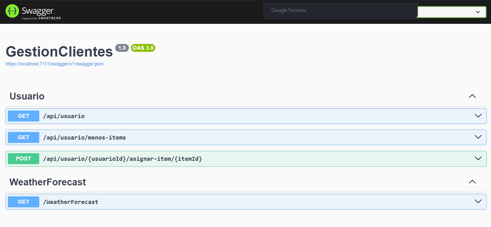
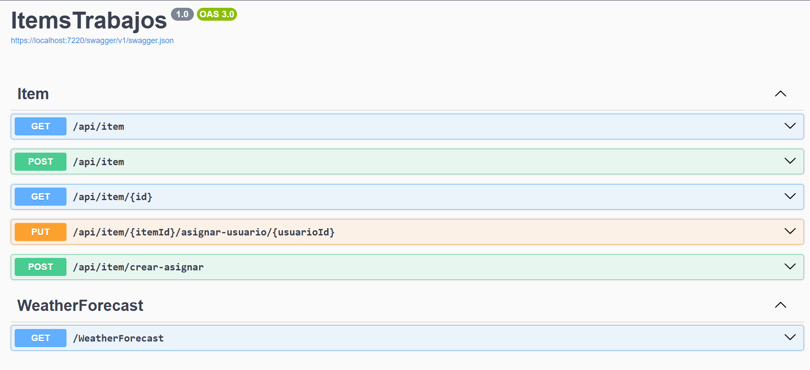

# GestionUsuariosConfiamed

Este repositorio contiene dos microservicios desarrollados en ASP.NET Core 8:

- **GestionClientes**: API para la gestión de usuarios/clientes.
- **ItemsTrabajos**: API para la gestión de items de trabajo y asignaciones.

## Requisitos previos

- [.NET 8 SDK](https://dotnet.microsoft.com/en-us/download/dotnet/8.0)

## Cómo iniciar cada proyecto

### GestionClientes

1. Abre una terminal en la carpeta `GestionClientes`.
2. Ejecuta:
   ```sh
   dotnet run
   ```
3. La API estará disponible en `https://localhost:5001` (o el puerto configurado).
4. Accede a la documentación Swagger en `https://localhost:5001/swagger`.

### ItemsTrabajos

1. Abre una terminal en la carpeta `ItemsTrabajos`.
2. Ejecuta:
   ```sh
   dotnet run
   ```
3. La API estará disponible en `https://localhost:5002` (o el puerto configurado).
4. Accede a la documentación Swagger en `https://localhost:5002/swagger`.

## Imágenes de funcionamiento

A continuación se muestran ejemplos visuales del funcionamiento de cada API:

### GestionClientes



### ItemsTrabajos



---

Ambos proyectos pueden configurarse mediante los archivos `appsettings.json` y exponen endpoints documentados automáticamente con Swagger.

Para cualquier duda, revisa los controladores en las carpetas `Controllers/` de cada microservicio.
